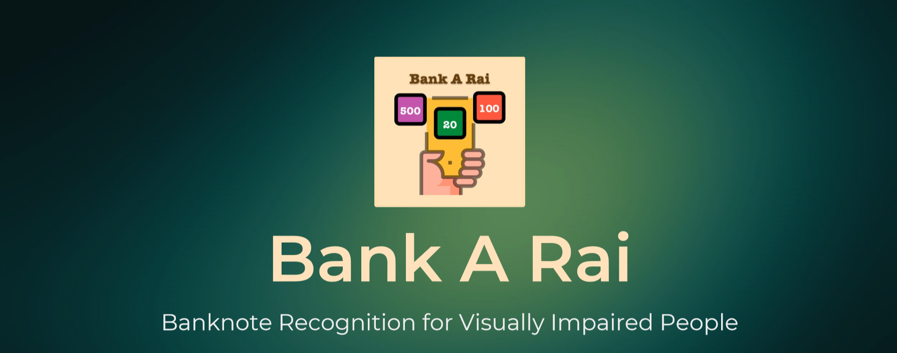

# BankARai

This application is a part of Senior Project II (CS4200) that created by Assumption University students.

Link to [Slide](docs/slide.pdf), [Demo](https://youtu.be/ezznRWPOrJk)

# Description

Android application for visually impaired people which will be used to detect and classify the types of Thai banknotes by using the deep learning technique

# Contributors

- Chatchawan yoojuie
- Pathompong Kunapermsiri
- Natthakul Boonmee
